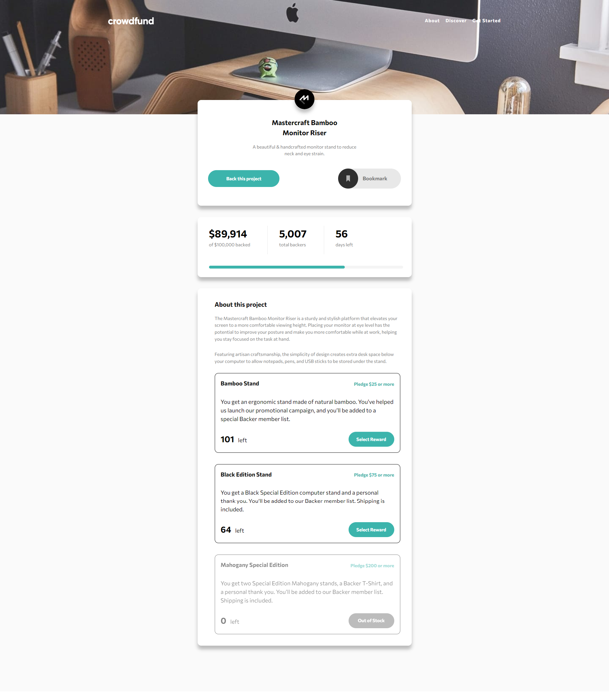
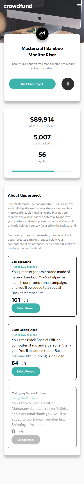

# Frontend Mentor - Crowdfunding product page solution

This is a solution to the [Crowdfunding product page challenge on Frontend Mentor](https://www.frontendmentor.io/challenges/crowdfunding-product-page-7uvcZe7ZR). Frontend Mentor challenges help you improve your coding skills by building realistic projects. 

## Table of contents

- [Overview](#overview)
  - [The challenge](#the-challenge)
  - [Screenshot](#screenshot)
  - [Links](#links)
- [My process](#my-process)
  - [Built with](#built-with)
  - [What I learned](#what-i-learned)
  - [Continued development](#continued-development)
  - [Useful resources](#useful-resources)
- [Author](#author)
- [Acknowledgments](#acknowledgments)

## Overview

### The challenge

Users should be able to:

- View the optimal layout depending on their device's screen size
- See hover states for interactive elements
- Make a selection of which pledge to make
- See an updated progress bar and total money raised based on their pledge total after confirming a pledge
- See the number of total backers increment by one after confirming a pledge
- Toggle whether or not the product is bookmarked

### Screenshot

### Links

- Solution URL: [Github repo](https://github.com/Robertron624/crowdfunding-product-page)
- Live Site URL: [Add live site URL here](https://your-live-site-url.com)

## My process

### Built with

- Semantic HTML5 markup
- CSS custom properties
- Flexbox
- CSS Grid
- Mobile-first workflow
- [React](https://reactjs.org/) - JS library
- [sass](https://sass-lang.com/) - For styling
- [Material UI](https://material-ui.com/) - For modals

### What I learned

With this project I learned to work input radios and using its values for defining and altering the app state.

### Continued development

I want to start working in projects that require form handling and I'm planning on using other UI components library different from MaterialUI, maybe ChakraUI or DaisyUI.

### Useful resources

- [How to work with radio buttons in React](https://dev.to/collegewap/how-to-work-with-radio-buttons-in-react-3e0o) - This helped me for handling input radio buttons in React and states, was a really great read.

- [Pure CSS Custom Styled Radio Buttons](https://moderncss.dev/pure-css-custom-styled-radio-buttons/) - This is an amazing article which helped me to style the radio buttons in an easy way.

## Author

-   Personal Website - [Robert Ramirez](https://robert-ramirez.netlify.app)
-   Frontend Mentor User- [@Robertron624](https://www.frontendmentor.io/profile/Robertron624)
-   Twitter - [@robertdowny](https://www.twitter.com/robertdowny)
